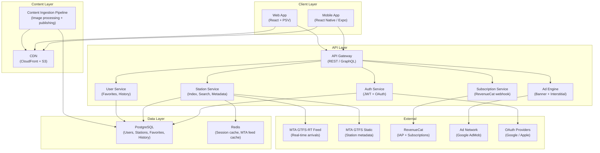
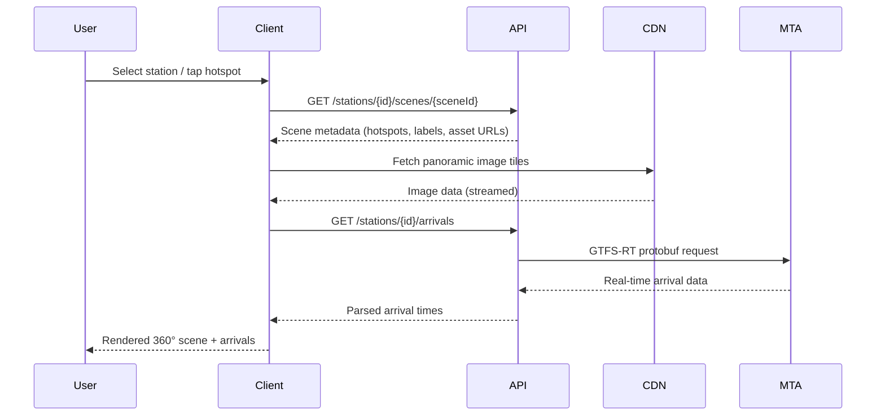

# Design Document: NYC Subway Virtual Tour

## Overview

The NYC Subway Virtual Tour is a cross-platform application (React Native / Expo for mobile, React for web) that lets users explore all NYC subway stations through immersive 360-degree panoramic imagery. Users navigate between scenes within a station using interactive hotspots, access real-time MTA data, and optionally subscribe to a premium tier for an ad-free experience with offline downloads.

The system is composed of a mobile/web client, a backend API, a content delivery layer for panoramic assets, and integrations with the MTA's public data feeds. A content ingestion pipeline is also required to process and publish the 360-degree imagery captured in the field.

### Key Design Decisions

- **React Native + Expo** for the mobile client to share code across iOS and Android while retaining access to native APIs (gyroscope, file system, IAP).
- **React + Photo Sphere Viewer (PSV)** for the web client, which provides a mature WebGL-based 360° renderer with a plugin ecosystem for hotspots, virtual tours, and compass overlays ([photo-sphere-viewer.js.org](https://photo-sphere-viewer.js.org)).
- **RevenueCat** for in-app purchase and subscription management, abstracting Apple App Store and Google Play Billing behind a unified SDK ([revenuecat.com](https://www.revenuecat.com)).
- **MTA GTFS-Realtime** feeds for live train arrival data, consumed via Protocol Buffer parsing ([gtfs.org](https://gtfs.org/documentation/realtime/reference/)).
- **CDN-backed object storage** (e.g., AWS S3 + CloudFront) for panoramic image assets, enabling efficient global delivery and offline download packaging.
- **JWT-based session tokens** issued by the Auth Service, valid for 30 days, with OAuth 2.0 support for Google and Apple sign-in.

### Content Acquisition Note

The user is considering having a team physically photograph all NYC subway stations (~472 stations) using 360-degree cameras. This is an operational concern, but the design must accommodate a **content ingestion pipeline** that accepts raw equirectangular images, processes them (stitching, compression, tiling for multi-resolution), and publishes them to the CDN with associated metadata. The pipeline is a prerequisite for the app to have content.

---

## Architecture

The system follows a layered client-server architecture with a CDN for media delivery.



### Data Flow: Scene Loading



---

## Components and Interfaces

### 1. Viewer Component

The core 360-degree rendering component. On web, this wraps **Photo Sphere Viewer** with its `MarkersPlugin` and `VirtualTourPlugin`. On mobile, it uses a `WebView` embedding a lightweight PSV instance, or a native OpenGL-based renderer via `react-native-panorama-view`.

**Interface:**

```typescript
interface ViewerProps {
  scene: Scene;
  onHotspotTap: (hotspot: Hotspot) => void;
  onSceneLoad: () => void;
  onSceneError: (error: Error) => void;
  reducedMotion: boolean;
  accessibilityLabel: string;
}
```

**Responsibilities:**
- Render equirectangular panoramic images as interactive spheres
- Display hotspot overlays at specified yaw/pitch coordinates
- Handle touch gestures (pan, pinch-to-zoom) and gyroscope input
- Enforce FOV bounds: minimum 60°, maximum 120°
- Announce scene label and hotspot directions to screen readers
- Substitute direct-cut transitions when `reducedMotion` is true

### 2. Station Service

Backend service responsible for the station index, search, and metadata.

**REST Endpoints:**

```
GET  /stations                    → paginated station list
GET  /stations/search?q=&borough=&line=  → filtered search (≤500ms)
GET  /stations/{id}               → station detail + scene list
GET  /stations/{id}/scenes/{sceneId}     → scene metadata + hotspots
GET  /stations/{id}/arrivals      → real-time MTA arrivals (cached 30s)
```

**Search Implementation:**
- Full-text search index on station name, borough, and line identifiers
- PostgreSQL `tsvector` index or Elasticsearch for sub-500ms response
- Results ranked by relevance; empty results return suggestions (nearby by geo, or popular by visit count)

### 3. Auth Service

Handles registration, login, OAuth, and session token issuance.

**REST Endpoints:**

```
POST /auth/register               → email + password registration
POST /auth/login                  → email + password login
POST /auth/oauth/{provider}       → Google / Apple OAuth callback
POST /auth/logout                 → invalidate session
GET  /auth/session                → validate current session
```

**Token:** JWT, RS256 signed, 30-day expiry, containing `userId`, `tier` (`free` | `premium`), and `exp`.

### 4. User Service

Manages favorites and browsing history for authenticated users.

**REST Endpoints:**

```
GET    /users/{id}/favorites          → list favorites
POST   /users/{id}/favorites          → add favorite (stationId)
DELETE /users/{id}/favorites/{stationId} → remove favorite
GET    /users/{id}/history            → list history (last 50, desc by timestamp)
POST   /users/{id}/history            → record visit (upsert by stationId)
```

### 5. Ad Engine

Client-side component that integrates with Google AdMob. The backend Ad Service provides configuration (ad unit IDs, frequency rules) but ad rendering is handled natively on the client.

**Rules enforced client-side:**
- Banner ads shown on non-immersive screens for `free` tier users
- Interstitial shown after every 5th scene transition for `free` tier users
- No ads shown for `premium` tier users
- Dismiss option rendered within 5 seconds of interstitial display

### 6. Subscription Service

Thin backend service that receives RevenueCat webhooks to update user tier in the database. The client uses the RevenueCat SDK directly for purchase flows.

**Webhook Events Handled:**
- `INITIAL_PURCHASE` → set user tier to `premium`
- `RENEWAL` → extend premium expiry
- `CANCELLATION` / `EXPIRATION` → revert to `free` at period end
- `BILLING_ISSUE` → trigger in-app + email notification

### 7. Content Ingestion Pipeline

Offline pipeline (not user-facing) for processing raw 360° imagery captured in the field.

**Steps:**
1. **Ingest**: Upload raw equirectangular JPEG/TIFF from camera to S3 staging bucket
2. **Stitch** (if multi-image): Automated stitching via Hugin or PTGui CLI
3. **Tile**: Generate multi-resolution tiles for progressive loading (PSV `tiles` format)
4. **Compress**: WebP conversion for web; JPEG for mobile fallback
5. **Publish**: Move to production S3 bucket, invalidate CDN cache
6. **Register**: Insert/update scene record in PostgreSQL with asset URLs, hotspot coordinates, and area label

### 8. Offline Download Manager (Mobile)

Client-side component managing station package downloads for premium users.

**Package contents per station:**
- All scene panoramic images (tiled WebP)
- Scene metadata JSON (hotspots, labels, mini-map SVG)
- Station info JSON (cached MTA static data)

**Storage:** `expo-file-system` for file storage; SQLite (via `expo-sqlite`) for download manifest tracking.

---

## Data Models

### Station

```typescript
interface Station {
  id: string;                    // GTFS stop_id (e.g., "101")
  name: string;                  // e.g., "Times Sq-42 St"
  borough: "Manhattan" | "Brooklyn" | "Queens" | "Bronx" | "Staten Island";
  lines: string[];               // e.g., ["1", "2", "3", "7", "N", "Q", "R", "W"]
  coordinates: { lat: number; lng: number };
  adaAccessible: boolean;
  openingYear: number | null;
  notableFeatures: string | null;
  primarySceneId: string;
  scenes: Scene[];
  downloadSizeBytes: number;     // total size of offline package
}
```

### Scene

```typescript
interface Scene {
  id: string;
  stationId: string;
  areaLabel: string;             // e.g., "Northbound Platform", "Mezzanine"
  panoramaUrl: string;           // CDN URL to equirectangular image or tile manifest
  thumbnailUrl: string;
  hotspots: Hotspot[];
  minimapPosition: { x: number; y: number }; // normalized [0,1] coords on station floor plan
  capturedAt: string;            // ISO 8601 date
}
```

### Hotspot

```typescript
interface Hotspot {
  id: string;
  sceneId: string;
  linkedSceneId: string;
  yaw: number;                   // degrees, -180 to 180
  pitch: number;                 // degrees, -90 to 90
  label: string;                 // e.g., "→ Southbound Platform"
  type: "navigation" | "info";
  infoContent?: string;          // for info-type hotspots
}
```

### User

```typescript
interface User {
  id: string;
  email: string;
  passwordHash: string | null;   // null for OAuth-only accounts
  oauthProvider: "google" | "apple" | null;
  oauthSubject: string | null;
  tier: "free" | "premium";
  premiumExpiresAt: string | null; // ISO 8601
  createdAt: string;
}
```

### Favorite

```typescript
interface Favorite {
  userId: string;
  stationId: string;
  createdAt: string;
}
```

### HistoryEntry

```typescript
interface HistoryEntry {
  userId: string;
  stationId: string;
  visitedAt: string;             // updated on re-visit (upsert)
}
```

### DownloadManifest (client-side SQLite)

```typescript
interface DownloadManifest {
  stationId: string;
  status: "pending" | "downloading" | "complete" | "error";
  totalBytes: number;
  downloadedBytes: number;
  localPath: string;
  downloadedAt: string | null;
}
```

---

## Correctness Properties

*A property is a characteristic or behavior that should hold true across all valid executions of a system — essentially, a formal statement about what the system should do. Properties serve as the bridge between human-readable specifications and machine-verifiable correctness guarantees.*

This feature involves significant business logic in search filtering, navigation state management, user data management, ad frequency counting, and access control. Property-based testing is appropriate for these components. The recommended PBT library is **fast-check** (TypeScript/JavaScript), which integrates well with Jest and Vitest.

---

### Property 1: Search results always match the query

*For any* search query string, every station returned by the Station_Index search SHALL match the query by at least one of: station name (substring, case-insensitive), borough name, or subway line identifier.

**Validates: Requirements 1.2**

---

### Property 2: Station preview card contains required fields

*For any* station in the index, the preview card rendered when a user taps its map marker SHALL contain the station name, at least one subway line, and a tour entry action.

**Validates: Requirements 1.5**

---

### Property 3: FOV stays within bounds after any zoom gesture

*For any* sequence of pinch-to-zoom gestures applied to the Viewer, the resulting field of view SHALL always be within the closed interval [60°, 120°].

**Validates: Requirements 2.4**

---

### Property 4: Hotspot navigation always loads the correct linked scene

*For any* hotspot with a `linkedSceneId`, tapping that hotspot SHALL cause the Viewer to load exactly the scene identified by `linkedSceneId`.

**Validates: Requirements 2.6**

---

### Property 5: Scene navigation updates the mini-map

*For any* scene navigation event, the mini-map's highlighted position SHALL reflect the newly active scene's `minimapPosition` after the transition completes.

**Validates: Requirements 3.5**

---

### Property 6: Station info panel contains all required fields

*For any* station, the rendered information panel SHALL contain the station name, all serving subway lines, the borough, and the ADA accessibility status.

**Validates: Requirements 4.1, 4.2**

---

### Property 7: Email and password validation is consistent

*For any* string input as an email address, the Auth Service SHALL accept it if and only if it conforms to a valid email format (RFC 5322 simplified). *For any* string input as a password, the Auth Service SHALL accept it if and only if its length is at least 8 characters.

**Validates: Requirements 5.3**

---

### Property 8: Duplicate registration is always rejected

*For any* email address already associated with an existing account, a subsequent registration attempt with that same email SHALL be rejected with an error, and the total number of accounts with that email SHALL remain exactly one.

**Validates: Requirements 5.4**

---

### Property 9: Session tokens are valid for exactly 30 days

*For any* successful authentication, the issued JWT's `exp` claim SHALL be within a 60-second window of 30 days after the `iat` claim.

**Validates: Requirements 5.5**

---

### Property 10: Unauthenticated users can access any scene

*For any* scene in the system, a request to load that scene without an authentication token SHALL succeed (HTTP 200) and return the scene metadata.

**Validates: Requirements 5.7**

---

### Property 11: Favorites round-trip (add then query)

*For any* authenticated user and any station, marking the station as a favorite and then querying the user's favorites list SHALL result in that station appearing in the list.

**Validates: Requirements 6.1, 6.2**

---

### Property 12: Favorites removal is immediate and complete

*For any* station in a user's favorites list, removing it SHALL result in the station no longer appearing in the favorites list, and the list length SHALL decrease by exactly one.

**Validates: Requirements 6.6**

---

### Property 13: History never exceeds 50 entries

*For any* sequence of station visits by an authenticated user, the browsing history list SHALL never contain more than 50 entries, with the oldest entries evicted when the limit is reached.

**Validates: Requirements 6.3**

---

### Property 14: History deduplication on re-visit

*For any* station visited more than once by the same user, the history list SHALL contain exactly one entry for that station, with the `visitedAt` timestamp reflecting the most recent visit.

**Validates: Requirements 6.4**

---

### Property 15: Free-tier users always see ads on non-immersive screens

*For any* free-tier user session on any non-immersive screen, the Ad Engine SHALL render at least one banner advertisement.

**Validates: Requirements 7.1**

---

### Property 16: Interstitial appears at every 5th scene transition for free-tier users

*For any* sequence of N scene transitions by a free-tier user, the number of interstitial advertisements displayed SHALL equal ⌊N / 5⌋.

**Validates: Requirements 7.2**

---

### Property 17: Premium users never see advertisements

*For any* premium-tier user session on any screen or scene, the Ad Engine SHALL not render any advertisement (banner or interstitial).

**Validates: Requirements 7.3, 8.3**

---

### Property 18: Ad dismiss option appears within 5 seconds

*For any* displayed interstitial advertisement, a clearly labeled dismiss control SHALL be visible no later than 5 seconds after the ad begins rendering.

**Validates: Requirements 7.4**

---

### Property 19: Ad content filter rejects prohibited categories

*For any* advertisement metadata tagged with categories "adult content", "gambling", or "illegal services", the Ad Engine SHALL reject the ad and not display it.

**Validates: Requirements 7.5**

---

### Property 20: Subscription expiry reverts user to free tier

*For any* premium user whose subscription has expired or been cancelled, the user's `tier` field SHALL be `"free"` after the billing period end date has passed.

**Validates: Requirements 8.4**

---

### Property 21: Subscription status display is accurate

*For any* user, the subscription status and renewal date displayed in account settings SHALL match the values stored in the User record.

**Validates: Requirements 8.5**

---

### Property 22: Offline navigation works for all downloaded scenes

*For any* station that has been fully downloaded, all scenes within that station SHALL be navigable while the device is in offline mode, with no network requests required.

**Validates: Requirements 9.3**

---

### Property 23: Storage display reflects actual downloaded content

*For any* set of downloaded station packages, the total storage size displayed in the app SHALL equal the sum of the `totalBytes` values in the download manifest for all completed downloads.

**Validates: Requirements 9.5**

---

### Property 24: All non-text UI elements have text alternatives

*For any* non-text UI element rendered on a non-immersive screen, the element SHALL have a non-empty `accessibilityLabel` (iOS) or `contentDescription` (Android).

**Validates: Requirements 10.2**

---

### Property 25: Screen reader receives scene label and hotspot directions

*For any* scene with N hotspots, the accessibility tree SHALL contain the scene's `areaLabel` and exactly N hotspot direction labels accessible to screen readers.

**Validates: Requirements 10.3**

---

### Property 26: Reduced motion disables animated transitions

*For any* scene transition when the device's reduced motion setting is enabled, the transition SHALL complete without any animation (direct cut), and no animation frames SHALL be rendered between the outgoing and incoming scenes.

**Validates: Requirements 10.5**

---

## Error Handling

### Scene Load Failure
- If a panoramic image fails to load within 10 seconds, the Viewer displays an error state with a "Retry" button.
- Retry uses exponential backoff (1s, 2s, 4s) up to 3 attempts before showing a permanent error.
- Offline mode: if the scene is in the download manifest with status `complete`, load from local storage instead of CDN.

### MTA Feed Unavailability
- Station metadata: served from Redis cache (TTL 24h). If cache is cold and feed is down, return last-known data with a `stale: true` flag and `lastUpdatedAt` timestamp.
- Real-time arrivals: cached for 30 seconds. If the GTFS-RT feed is unreachable, return a `503` with a user-facing message: "Live arrivals temporarily unavailable."

### Authentication Errors
- Expired session token: client receives `401 Unauthorized`, clears local token, and redirects to login screen.
- Duplicate registration: `409 Conflict` with message "An account with this email already exists."
- Invalid credentials: `401 Unauthorized` with generic message (no enumeration of whether email or password is wrong).

### Subscription / Payment Errors
- RevenueCat billing issue webhook: backend sets a `billingIssue: true` flag on the user record, triggers an in-app notification on next app open, and sends an email via the notification service.
- IAP receipt validation failure: client shows an error dialog with a "Contact Support" link.

### Offline Access to Non-Downloaded Station
- Client checks the download manifest before attempting to load a station.
- If the station is not in the manifest (or status is not `complete`) and the device is offline, show: "This station isn't available offline. Download it while connected to explore it without internet."

### Network Errors (General)
- All API calls use a retry policy: 3 attempts with exponential backoff for `5xx` and network timeout errors.
- `4xx` errors are not retried and surface user-facing messages.

---

## Testing Strategy

### Unit Tests

Unit tests cover specific examples, edge cases, and error conditions for pure logic components:

- **Search filtering logic**: specific query/result pairs, empty query, special characters
- **Auth validation**: valid/invalid email formats, password length boundary (7 chars rejected, 8 chars accepted)
- **History deduplication**: re-visiting the same station updates timestamp, not count
- **History eviction**: visiting the 51st station evicts the oldest entry
- **Ad frequency counter**: transitions 1–4 show no interstitial, transition 5 shows one, transition 10 shows one
- **FOV clamping**: zoom beyond 120° clamps to 120°, zoom below 60° clamps to 60°
- **JWT expiry calculation**: token issued at time T has `exp` = T + 30 days
- **Tier access control**: premium user gets no ads, free user gets ads

### Property-Based Tests (fast-check)

Each correctness property above is implemented as a single property-based test with a minimum of **100 iterations**. Tests are tagged with the property they validate.

Tag format: `Feature: nyc-subway-virtual-tour, Property {N}: {property_text}`

Key generators needed:
- `arbitraryStation()` — generates a Station with random name, borough, lines, coordinates
- `arbitraryScene()` — generates a Scene with random hotspots and area label
- `arbitraryHotspot()` — generates a Hotspot with valid yaw/pitch and a linked scene ID
- `arbitraryUser(tier)` — generates a User with specified tier
- `arbitrarySearchQuery()` — generates strings including empty, whitespace-only, special characters, and valid substrings of station names
- `arbitraryZoomGesture()` — generates pinch scale factors (including extreme values)
- `arbitraryAdMetadata()` — generates ad objects with random category tags including prohibited ones
- `arbitraryVisitSequence(length)` — generates sequences of station IDs including duplicates

### Integration Tests

Integration tests verify external service wiring with 1–3 representative examples:

- **MTA GTFS-RT**: fetch real-time arrivals for Times Sq-42 St, verify response structure
- **OAuth flow**: mock Google/Apple OAuth callback, verify JWT is issued
- **RevenueCat webhook**: send mock `INITIAL_PURCHASE` event, verify user tier updates to `premium`
- **CDN asset delivery**: fetch a known panoramic image URL, verify HTTP 200 and correct content type

### Smoke Tests

One-time setup and configuration checks:

- Station index contains ≥ 400 stations (MTA has ~472 operational stations)
- Monthly and annual subscription products are configured in RevenueCat
- WCAG 2.1 AA automated audit passes on search, station info, and account screens (using axe-core)
- Map view renders markers for all stations in the index

### Accessibility Testing

- Automated: axe-core integrated into the CI pipeline for all non-immersive screens
- Manual: screen reader testing (VoiceOver on iOS, TalkBack on Android) for the Viewer component
- Note: Full WCAG 2.1 AA compliance requires manual expert review beyond automated tooling

### Performance Testing

- Viewer frame rate benchmark: render a 360° scene on a reference device (iPhone 12 / Pixel 6), measure FPS over 30 seconds, assert ≥ 30 FPS
- Search latency: measure p95 response time for search queries against a production-scale station index, assert ≤ 500ms
- Scene load time: measure time from scene selection to first render, assert ≤ 10 seconds on a 4G connection
